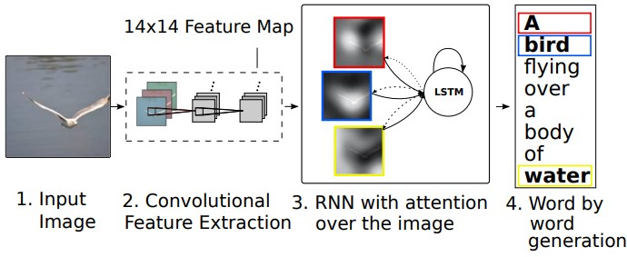

# Image caption generator

Hello and welcome to **Image caption generator 🖼️🤔** project. You can now generate captions to for images using attention based models!

### TODO:

- [x] Create initial setup
- [x] Create notebook for modelling experiments
- [x] Run notebook with GPU
- [ ] Export model for inference
- [ ] Revamp README to look better
- [ ] Create Huggingface Spaces app to deploy

## Introduction

This project is inspired by the **[Show, Attend and Tell](https://arxiv.org/abs/1502.03044)** research paper. This paper introduces an attention based model that learns to describe the contents of images. A transformer is a deep learning model that adopts the mechanism of self-attention, differentially weighting the significance of each part of the input data.  
While doing this project, I learned various architectures and preprocessing techniques to read and clean data, attention mechanism and how to pair it with CNN models.

## Data

The model was trained on the popular [Flickr8k dataset](https://paperswithcode.com/dataset/flickr-8k). This dataset is famous for models to be trained for image captioning. In this dataset, there are over 8,000 images, that are each paired with five different captions. This leads to enough data to the model to be trained on. The data was read using typical file reading conventions, because of lack of data-loaders.

## Model

  
The model consists of three sub-models:

- CNN: This layer is used to extract the feature map from the image. This feature map is then leaned by further layers to then create captions for the image. Rather than creating complicated network, this CNN layer uses the EfficientNetB0 architecture. The EfficientNet is then freezed to only work as feature extractor.

## References

## Repository structure
